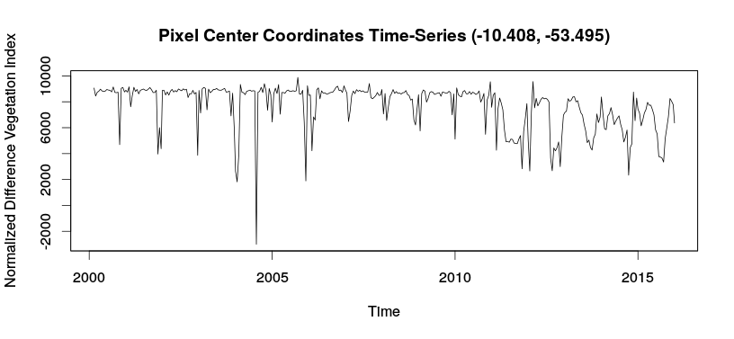

# R Client API for Web Time Series Service

**wtss.R** is an R client package for handling Web Time-Series Service (WTSS) in the client side. For more information on WTSS see  its specification and documentation in the TWS [site](https://github.com/e-sensing/tws). 

This R Client API is based on the orginal version developed by Alber Sanchez at https://github.com/albhasan/rwtss.

## Getting started

Installing and loading wtss.R package

``` r
> devtools::install_github("e-sensing/wtss.R")
> library(wtss.R)
```

A simple example of creating a WTSS connection

``` r 
> ts.server <- WTSS("http://www.dpi.inpe.br/tws/wtss")
```

The result is a Object of Class WTSS. 

``` r
> ts.server
Object of Class WTSS

serverUrl:  http://www.dpi.inpe.br/tws/wtss 
listCoverages: MOD13Q1 mod13q1_512

```

It is possible to get the list of coverages provided by the service.

```r
# listing coverages of the server 
> coverages <- listCoverages(ts.server)
```

The object is a vector containing all the coverages provided by the service. 

```r
> coverages
[1] "MOD13Q1"     "mod13q1_512"
```

After that, we are able to acquire the coverage metadata. This function returns a named list of the coverage containing its attributes.

```r
# get the description of the second coverage 
> coverage.name <- coverages[2]
> cv <- describeCoverage(ts.server, coverage.name)
```

Finally, users can get the time series based on a set of required parameters.

```r
# define the attributes of the coverages
> attributes <- cv[[names(cv)]]$attributes$name

# define the longitude and latitude
> long <- -53.495
> lat <- -10.408

# define the start and end date
> start <- "2000-02-18"
> end <- "2016-01-01"
  
# get a time series 
> ts = timeSeries(ts.server, 
                  coverage.name, 
		  attributes, 
		  lat, 
		  long, 
		  start, 
		  end)
```

Plot the time series 

```r
plot(ts[[1]]$attributes[,1], main=sprintf("Pixel Center Coordinates Time-Series (%5.3f, %5.3f)", ts[[1]]$center_coordinate$latitude, ts[[1]]$center_coordinate$longitude), xlab="Time", ylab="Normalized Difference Vegetation Index")
```

<p align="center">

<p class="caption" align="center">
Figure 1 - Vegetation index (ts time series).
</p>
</p>

## References

G. R. de Queiroz, K. R. Ferreira, L. Vinhas, G. Camara, R. W. da Costa, R. C. M. de Souza, V. W. Maus, and A. Sanchez. WTSS: um serviço web para extração de séries temporais de imagens de sensoriamento remoto. In Proceeding of the XVII Remote Sensing Brazilian Symposium, pages 7553-7560, 2015.

## Reporting Bugs

Any problem should be reported to luizffga@dpi.inpe.br.
